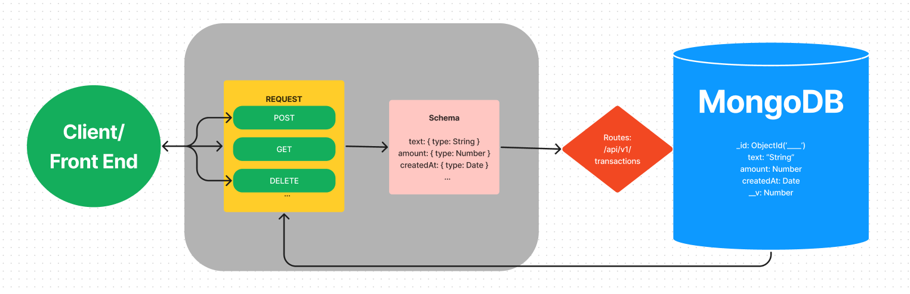

# Budget Tracker App
A full stack application that tracks all inputted expenses and income. Utilizes React components with hooks and context API.

## Deploy Link

## How to Use
To run locally, clone repository and type 'npm start' in command line

## Project Structure
- Implements full CRUD functionality
- Includes dynamic API Calls
- Schema Model utilized for transactions

## API
- Utilizes Context API

## UML

## Credits
Credit to bradtraversy for concept

## Contributing
Contributions are welcome! Please feel free to submit a Pull Request!